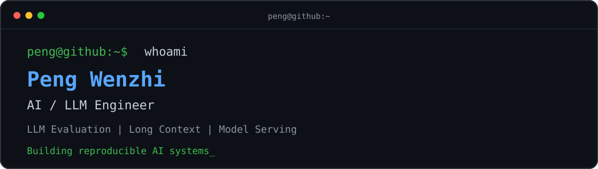

<div align="center">
  
</div>

<div align="center">

`LLM Evaluation` · `Long Context` · `Model Serving` · `Reproducible AI`

</div>

---

### `> whoami`

```yaml
name: Peng Wenzhi
role: AI / LLM Engineer
focus:
  - Large Language Models
  - Long-context evaluation
  - Inference and serving systems
  - Reproducible benchmarks
currently_exploring:
  - Spark X2.5
  - SGLang and vLLM
  - Needle-in-a-Haystack and GraphWalks
philosophy: "Measure carefully. Reproduce honestly. Ship reliably."
```

### `> stack --list`

```text
Languages    Python · C++ · Bash
AI / ML      PyTorch · Transformers · CUDA
Serving      SGLang · vLLM · OpenAI-compatible APIs
Evaluation   EvalScope · OpenCompass · Long-context benchmarks
Infra        Linux · Docker · Git · GitHub
```

### `> ls featured_projects/`

| Project | Description | Focus |
|---|---|---|
| [evalscope](https://github.com/pengwenzhi/evalscope) | LLM evaluation workflows and benchmark experiments | `Evaluation` `Benchmarking` |
| [GraphWalks](https://github.com/pengwenzhi/GraphWalks) | Graph-based long-context reasoning experiments | `Reasoning` `Long Context` |
| [Qwen3](https://github.com/pengwenzhi/Qwen3) | Exploration and experiments around the Qwen model family | `LLM` `Inference` |
| [OpenSandbox](https://github.com/pengwenzhi/OpenSandbox) | Infrastructure for agent and code-execution environments | `Agents` `Infrastructure` |

### `> status`

```text
[●] Designing trustworthy LLM evaluations
[●] Reproducing long-context benchmarks
[●] Turning research setups into runnable systems
[○] Always learning the next thing
```

### `> connect`

GitHub: [@pengwenzhi](https://github.com/pengwenzhi)

---

<div align="center">
  <sub>Code is evidence. Reproduction is trust.</sub>
</div>
